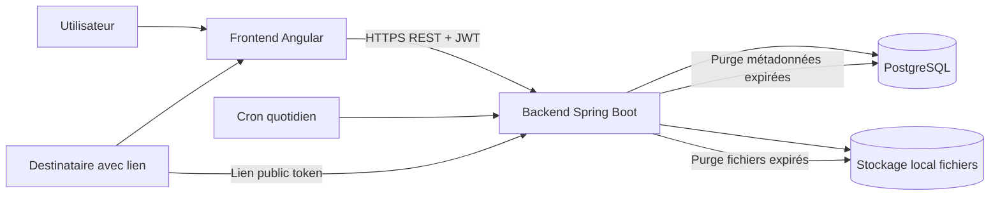

# Architecture de l'application — DataShare MVP

## Diagramme (simple)

## Briques techniques
- Frontend Angular : pages `upload`, `login`, `signup`, `download`, `mes-fichiers`.
- Backend Spring Boot : API REST, auth JWT, validation des entrées, règles métier.
- PostgreSQL : persistance `users` et `files`.
- Stockage local : conservation des binaires fichiers (hors répertoire public).
- Tâche planifiée : suppression automatique des fichiers expirés.

## Flux principaux
1. Inscription/connexion : frontend -> API -> DB -> JWT.
2. Upload (auth) : frontend -> API -> stockage local + DB -> lien token.
3. Download (public) : page publique -> API (token) -> métadonnées -> stream fichier.
4. Historique/suppression : frontend auth -> API -> DB + stockage.

## Sécurité (niveau MVP)
- Mots de passe utilisateurs hashés.
- JWT requis sur routes privées.
- Contrôle propriétaire sur historique/suppression.
- Token de téléchargement non prédictible.
- Validation serveur des contraintes (taille, expiration, mot de passe fichier).
