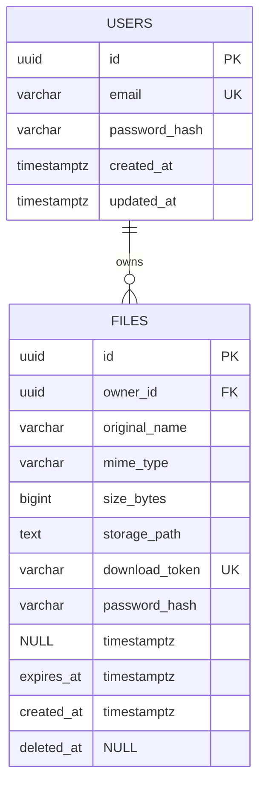

# Modèle de données — MCD / MLD (DataShare MVP)

## Périmètre
Ce modèle couvre les US obligatoires : US01 à US06.

- US03/US04 : `users`
- US01/US02/US05/US06 : `files`
- US08 (tags) : laissé en extension optionnelle

---

## MCD (conceptuel)

## Entités
- **Utilisateur**
  - id
  - email
  - password_hash
  - created_at
  - updated_at

- **Fichier**
  - id
  - owner_id
  - original_name
  - mime_type
  - size_bytes
  - storage_path
  - download_token
  - password_hash (nullable)
  - expires_at
  - created_at
  - deleted_at (nullable)

## Association
- Un **Utilisateur** possède 0..N **Fichiers**.
- Un **Fichier** appartient à exactement 1 **Utilisateur** (MVP orienté upload avec compte).

---

## MLD (relationnel)

## Table `users`
- `id` UUID PK
- `email` VARCHAR(255) UNIQUE NOT NULL
- `password_hash` VARCHAR(255) NOT NULL
- `created_at` TIMESTAMPTZ NOT NULL
- `updated_at` TIMESTAMPTZ NOT NULL

## Table `files`
- `id` UUID PK
- `owner_id` UUID NOT NULL FK -> `users(id)`
- `original_name` VARCHAR(255) NOT NULL
- `mime_type` VARCHAR(255) NOT NULL
- `size_bytes` BIGINT NOT NULL
- `storage_path` TEXT NOT NULL
- `download_token` VARCHAR(128) UNIQUE NOT NULL
- `password_hash` VARCHAR(255) NULL
- `expires_at` TIMESTAMPTZ NOT NULL
- `created_at` TIMESTAMPTZ NOT NULL
- `deleted_at` TIMESTAMPTZ NULL

## Index recommandés
- `users(email)` unique
- `files(download_token)` unique
- `files(owner_id)`
- `files(expires_at)`
- `files(owner_id, created_at desc)` pour l’historique

---

## Contraintes métier portées par le modèle
- Email utilisateur unique.
- Lien de téléchargement non ambigu via `download_token` unique.
- Historique filtrable par propriétaire via `owner_id`.
- Purge facilitée des expirés via `expires_at`.
- Soft delete optionnel via `deleted_at` (tout en supprimant le binaire côté stockage).

---

## Diagramme ER (Mermaid)

---

## Extension optionnelle (US08 Tags)
À ajouter seulement après stabilisation MVP :

- `tags(id, label, owner_id)`
- `file_tags(file_id, tag_id)`

avec contrainte d’unicité `(file_id, tag_id)`.
